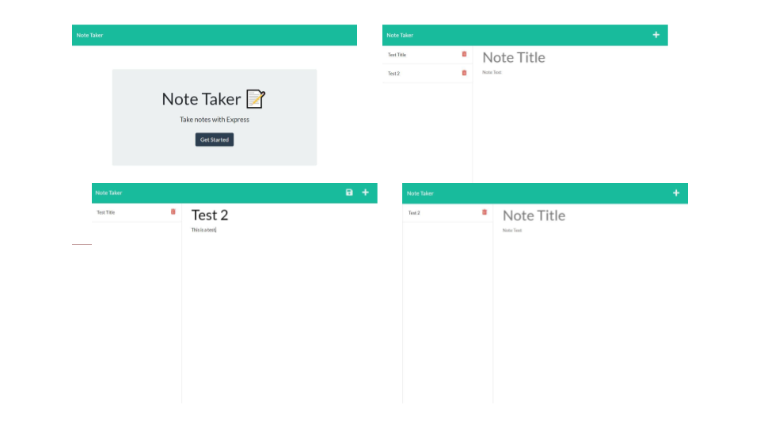

# 20210627 - Note-Taker-ZK 


 ## Table of Contents.
 * [Overview](#overview)
 * [Design](#overview)
 * [Installation](#overview)
 * [Usage](#overview)
 * [Criteria](#given-criteria)
 * [Questions](#have-questions)
 * [Links](#links)
 ---


## Overview 
Tasked to implement functionality in provided source code to allow user make, save, and delete notes.

## Design


The Layout and UI remains unchanged from provided source code.

## Installation Instructions
If using locally, you will need the following node modules: express and dotenv. Installing nodemon also recommended.*

npm init
npm i express
npm i dotenv
npm i nodemon*

## Usage Instructions
To use locally node server.js or nodemon serer.js* then in a browser go to http://localhost:3000/

Navigate the sight enter text and press save, notes can be deleted. If server is restarted notes will be lost.

---
## Given Criteria
* All saved notes are presented in left hand column.
* Save icon appears when title and note body are filled
* Clicking on a saved note from the left hand column re-opens that note in the main body to be edited further.
* The + icon in the top right corner opens a new blank note when pressed.
* The trashcan icon deletes a note when clicked.

---
## Have Questions
### You can contact me at:

GITHUB: <https://github.com/ZacharyWK>

EMAIL: <ZachKrause@live.com>


---
## Links
[REPOSITORY](https://github.com/ZacharyWK/Note-Taker-ZK)
```
https://github.com/ZacharyWK/Note-Taker-ZK
```

[DEPLOYED](https://zacharywk.github.io/Note-Taker-ZK/)
```
https://zacharywk.github.io/Note-Taker-ZK/
```
